# Database Schema: Research Pipeline API

This document describes the Supabase-backed Postgres tables that support the Research Pipeline API. It includes usage patterns, constraints, and implementation quirks relevant to developers working on the FastAPI backend.

---

## Core Tables and Relationships

### `projects`
- Represents a single user’s research pipeline project.
- Owned by a single user (`owner_id`) but may have collaborators.

**Fields**:
- `id`: `UUID` (PK)
- `owner_id`: `UUID` (FK to `auth.users`)
- `query`: `TEXT`
- `created_at`: `TIMESTAMP`

**Notes**:
- Deleting a `project` will **cascade delete** related records:
  - `papers`, `filters`, `project_sources`, `collaborators`, `extraction_configs`, and associated nested tables.

---

### `papers`
- A document (e.g. academic paper) attached to a project.

**Fields**:
- `id`: `UUID` (PK)
- `project_id`: `UUID` (FK to `projects`)
- `title`, `abstract`: `TEXT`

---

### `filters`
- Text-matching or rule-based logic that evaluates paper content.

**Fields**:
- `id`: `UUID`
- `project_id`: `UUID` (FK to `projects`)
- `filter_scope`: ENUM (`abstract`, `title`, etc.)
- `user_specified_text_filter`: `TEXT`
- `timestamp`: `TIMESTAMP`

**Constraints**:
- **Create/Delete allowed**
- **Update is not allowed**: attempts to update will silently fail due to RLS `WITH CHECK`.

**FastAPI Tip**:
```python
# Creating a filter
await client.post("/rest/v1/filters", headers=headers, json={
    "id": str(uuid4()),
    "project_id": project_id,
    "timestamp": datetime.utcnow().isoformat(),
    "filter_scope": "abstract",
    "user_specified_text_filter": "machine learning"
})
```

---

### `paper_filter_results`
- Maps a filter's evaluation result on a specific paper.

**Fields**:
- `id`: `UUID`
- `paper_id`: `UUID`
- `filter_id`: `UUID`
- `passed`: `BOOLEAN`

**Cascade Behavior**:
- Deleting a `filter` or `paper` **automatically deletes** corresponding rows in `paper_filter_results`.

---

### `project_sources`
- Sources of documents (e.g., arXiv, PubMed).

**Fields**:
- `id`: `UUID`
- `project_id`: `UUID`
- `backend_name`, `backend_query`: `TEXT`

---

### `extraction_configs`
- Groups of extraction logic tied to a project.

**Fields**:
- `id`: `UUID`
- `project_id`: `UUID`
- `created_at`: `TIMESTAMP`

---

### `extraction_fields`
- Specific fields extracted from papers (e.g. Author, Date).

**Fields**:
- `id`: `UUID`
- `config_id`: `UUID`
- `field_name`, `description`: `TEXT`

**Constraints**:
- **Create/Delete allowed**
- **Update is not allowed**: enforced via RLS `WITH CHECK`. A `PATCH` returns 200 but no changes occur.

**FastAPI Tip**:
```python
# Create a new extraction field
await client.post("/rest/v1/extraction_fields", headers=headers, json={
    "id": str(uuid4()),
    "config_id": config_id,
    "field_name": "Author",
    "description": "Primary author of the paper"
})
```

### `extracted_fields`
- Results of an extraction field applied to a paper.

**Fields**:
- `id`: `UUID`
- `paper_id`: `UUID`
- `extraction_field_id`: `UUID`
- `field_value`: `TEXT`

**Cascade Behavior**:
- Deleting a `paper` or `extraction_field` removes `extracted_fields`.

---

## 🔐 Row-Level Security (RLS)

Note: Collaborator policies are not yet implemented, but are planned.

### General Rules

| Table                    | Read                 | Write (Create/Delete) | Update | Notes |
|--------------------------|----------------------|------------------------|--------|-------|
| `projects`               | Owner + Collaborators | Owner                 | ✓      | |
| `papers`                 | Owner via project     | Owner                 | ✓      | |
| `filters`                | Owner via project     | ✓                     | ❌     | Update blocked via RLS |
| `extraction_configs`     | Owner via project     | ✓                     | ✓      | |
| `extraction_fields`      | Owner via project     | ✓                     | ❌     | Update blocked via RLS |
| `extracted_fields`       | Owner via project     | ✓                     | ✓      | |
| `paper_filter_results`   | Owner via paper+filter| ✓                     | ✓      | Cascade-deleted if parent is deleted |

---

## 🧪 Example FastAPI Snippets

### Insert a Paper
```python
await client.post("/rest/v1/papers", headers=headers, json={
    "id": str(uuid4()),
    "project_id": project_id,
    "title": "New Paper",
    "abstract": "Some abstract..."
})
```

### Delete a Project (Triggers full cascade)
```python
await client.delete(
    f"/rest/v1/projects?id=eq.{project_id}",
    headers={**headers, "Prefer": "return=minimal"}
)
```

### Filter Access Denial Example
```python
# Attempt to patch — will return 200 but change nothing
resp = await client.patch(f"/rest/v1/filters?id=eq.{filter_id}", headers=headers, json={
    "user_specified_text_filter": "new-value"
})
assert resp.status_code == 200
assert resp.json() == []  # RLS silently blocks update
```

---

## 🔁 Deletion Behavior and Cascade Maps

This section documents what happens when you delete various core entities. Deletions follow PostgreSQL `ON DELETE CASCADE` foreign key constraints and/or triggers. **Row-Level Security (RLS)** can interfere with visibility, so test these flows carefully.

---

### 1️⃣ Deleting a `project`

Deleting a project removes nearly all related data in the research pipeline.

```mermaid
graph TD
    Project["🗂 project"] --> Papers["📄 papers"]
    Project --> Filters["🔍 filters"]
    Project --> Sources["🌐 project_sources"]
    Project --> Collaborators["👥 collaborators"]
    Project --> ExtractionConfigs["⚙️ extraction_configs"]

    ExtractionConfigs --> ExtractionFields["🏷 extraction_fields"]
    ExtractionFields --> ExtractedFields["📥 extracted_fields"]

    Papers --> ExtractedFields
    Papers --> PaperFilterResults["✅ paper_filter_results"]

    Filters --> PaperFilterResults
```

<details>
<summary>Click to view graph (Mermaid)</summary>


</details>

---

### 2️⃣ Deleting a `paper`

Removes downstream extraction results and any filter result rows.

```mermaid
graph TD
    Paper["📄 paper"] --> ExtractedFields["📥 extracted_fields"]
    Paper --> PaperFilterResults["✅ paper_filter_results"]
```

<details>
<summary>Click to view graph (Mermaid)</summary>


</details>

---

### 3️⃣ Deleting an `extraction_config`

Deletes the config and its fields, and all extracted values associated with those fields.

```mermaid
graph TD
    ExtractionConfig["⚙️ extraction_config"] --> ExtractionFields["🏷 extraction_fields"]
    ExtractionFields --> ExtractedFields["📥 extracted_fields"]
```

<details>
<summary>Click to view graph (Mermaid)</summary>


</details>

---

### 4️⃣ Deleting an `extraction_field`

Deletes just the `extracted_fields` that depend on it.

```mermaid
graph TD
    ExtractionField["🏷 extraction_field"] --> ExtractedFields["📥 extracted_fields"]
```

<details>
<summary>Click to view graph (Mermaid)</summary>


</details>

---

### 5️⃣ Deleting a `filter`

Removes the `paper_filter_results` associated with the filter.

```mermaid
graph TD
    Filter["🔍 filter"] --> PaperFilterResults["✅ paper_filter_results"]
```

<details>
<summary>Click to view graph (Mermaid)</summary>


</details>

---

### Deletion Developer Notes

- **All deletions require RLS visibility**. If the deleting user cannot "see" the child rows (due to RLS), cascades may silently fail.
- **Postgres `ON DELETE CASCADE` is used** to enforce these deletions. Some relationships (like `paper_filter_results`) rely on composite references (e.g., paper + filter).
- **Always verify deletions in tests** using retry loops or polling endpoints, since async deletes can delay visibility.
---

## Quirks to Know
- **UUIDs**: All IDs are UUIDv4 — never use sequential integers.
